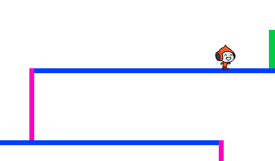

## حركة الشخصية

لنبدأ بإضافة شخصية يمكنها أن تتحرك إلى اليسار وإلى اليمين، وتصعد الدرجات.


+ افتح مشروع 'الكرة الخادعة' لبرنامج Scratch عبر الإنترنت على <a href="http://jumpto.cc/dodge-go" target="_blank">jumpto.cc/dodge-go</a> أو يمكنك تنزيله من <a href="http://jumpto.cc/dodge-get" target="_blank">jumpto.cc/dodge-get</a> ثم فتحه إذا كنت تستخدم محرر الرسم الموجود على الجهاز.

	يحتوي المشروع على خلفية ذات منصات:

	

+ أضف كائنًا جديدًا ليكون الشخصية المُستخدمة في اللعبة. ومن الأفضل أن تختار كائنًا له مظاهر متعددة، بحيث يمكنك أن تجعله يبدو وكأنه يمشي.

	

+ لنستخدم مفاتيح الأسهم لتحريك الشخصية في كل مكان. فعندما يضغط اللاعب على مفتاح سهم إلى اليمين، ستحتاج إلى توجيه الشخصية نحو اليمين وتحريكها بعض الخطوات وتغيير مظهرها إلى المظهر التالي:

	```blocks
		when flag clicked
		forever
			if <key [right arrow v] pressed? > then
				point in direction (90 v)
				move (3) steps
				next costume
			end
		end
  ```

+ اختبر الشخصية بالنقر فوق العلم ثم الضغط مطوَّلًا على مفتاح سهم إلى اليمين. هل تتحرك الشخصية إلى اليمين؟ هل تبدو الشخصية وكأنها تمشي؟

	

+ لتحريك الشخصية إلى اليسار، ستحتاج إلى إضافة قالب `if`{:class="blockcontrol"} أخرى داخل حلقة `كرِّر باستمرار`{:class="blockcontrol"}، بحيث تؤدي إلى تحريك الشخصية إلى اليسار.

+ اختبر التعليمة البرمجية الجديدة لتتأكد من أنها تعمل بالشكل المطلوب. هل تنقلب الشخصية عندما تسير ناحية اليسار؟

	

	إذا كان الأمر كذلك، فيمكنك إصلاح هذا الخطأ بالنقر فوق أيقونة `(i)`{:class="blocksensing"} الموجودة على كائن الشخصية، ثم النقر فوق سهم إلى اليسار-إلى اليمين.

	

	أو يمكنك إضافة هذا القالب إلى بداية النص البرمجي للشخصية إذا كنتَ تفضل ذلك:

	```blocks
		set rotation style [left-right v]
  ```

+ لصعود درجة قرنفلية اللون، يجب أن تتحرك الشخصية إلى أعلى مسافة قصيرة متى تم الضغط على مفتاح سهم إلى أعلى وكانت الشخصية تلامس اللون الصحيح. أضف هذه التعليمة البرمجية داخل حلقة `كرِّر باستمرار` {:class="blockcontrol"} الخاصة بالشخصية:

	```blocks
		if < <key [up arrow v] pressed?> and <touching color [#FF69B4]?> > then
			change y by (4)
		end
	```

+ اختبر الشخصية - هل تتسلق الدرجات قرنفلية اللون وتصل إلى نهاية المستوى؟

	


