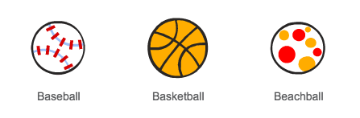

## تفادي الكرات

بعد أن جعلتَ الشخصية تتحرك في كل مكان، لنضِف بعض الكرات لتتفاداها الشخصية.


+ أنشئ كائن كرة جديدًا. يمكنك اختيار نوع الكرة الذي يعجبك!

	

+ غيِّر حجم الكرة، بحيث تستطيع الشخصية أن تقفز من فوقها. جرِّب القفز من فوق الكرة لاختبار ذلك. 

	

أضف هذه التعليمات البرمجية إلى الكرة:

 

 تُنشئ هذه التعليمة البرمجية نسخة جديدة من الكرة كل 3 ثوان. وستتحرك كل نسخة جديدة على المنصة العلوية.

+ انقر فوق العلم لاختبار ذلك.

	

+ أضف تعليمات برمجية أخرى إلى كائن الكرة بحيث يتحرك على كل المنصات الثلاث.

	

+ وأخيرًا، ستحتاج إلى تعليمة برمجية تعمل عند اصطدام الشخصية بالكرة! أضف هذه التعليمة البرمجية إلى كائن الكرة:

	```blocks
		when I start as a clone
		forever
			if < touching [Pico walking v]? > then
				broadcast [hit v]
			end
		end
	```

+ ستحتاج أيضًا إلى إضافة تعليمة برمجية إلى الشخصية لإرجاعها إلى الخلف لتبدأ من حيث اصطدمت:

	```blocks
		when I receive [hit v]
		point in direction (90 v)
		go to x: (-210) y: (-120)
	```

+ اختبر الشخصية لتلاحظ هل ترجع إلى الخلف لتبدأ من حيث اصطدمت بالكرة أم لا.


