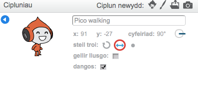

## Symudiad y Cymeriad

Fe wnawn ni ddechrau trwy greu cymeriad sy'n gallu symud i'r dde a chwith a dringo ysgol.

+ Agora brosiect 'Dodgeball' arlein yma<a href="http://jumpto.cc/dodge-go" target="_blank">jumpto.cc/dodge-go</a> new lawrlwytha'r prosiect yma<a href="http://jumpto.cc/dodge-get" target="_blank">jumpto.cc/dodge-get</a> yna ei agor os yn ei ddefnyddio ar y cyfrifiadur. 

	Mae'r prosiect yn cynnwys cefndir gyda'r platfform:

	

+ Ychwanega giplun newydd, sef dy gymeriad di. Mae'n well os wyt ti'n dewis ciplun gyda mwy nag un gwisg, fel dy fod di'n gallu gwneud iddo edrych fel ei fod yn cerdded.

	

+ Fe wnawn ni ddefnyddio'r saethau ar y bysellfwrdd i wneud i dy gymeriad symud.  Pan mae'r chwareuwr yn gwasgu'r saeth dde, rwyt ti eisiau i dy gymeriad bwyntio i'r dde, symud rhai camau a newid i'r wisg nesaf:

	```blocks
		pan fo ⚑ wedi ei glicio
			am byth
  			os <bysell [saeth de v] wedi ei wasgu?> wedyn
      		pwyntio i gyfeiriad (90 v)
      symud (3) cam
      gwisg nesaf
   end
		end
	```

+ Profa dy gymeriad trwy glicio ar y faner a gwasgu'r saeth dde. Ydy dy chwareuwr yn symud i'r dde? Ydy dy gymeriad yn edrych fel ei fod yn cerdded?

	

+ I symud dy gymeriad i'r chwith, bydd angen i ti ychwanegu bloc `os`{:class="blockcontrol"} arall yn dy ddolen `am byth`{:class="blockcontrol"} , sydd yn symud dy gymeriad i'r chwith.

+ Profa dy gôd newydd i wneud yn siwr ei fod yn gweithio. Ydy dy gymeriad yn troi ben i waered pan yn cerdded i'r chwith?

	

	Os felly, fe alli di drwsio hyn trwy glicio yr eicon `(i)`{:class="blocksensing"} ar gymeriad dy giplun, ac yn clicio y saeth chwith-dde.

	

	Neu, os oes well gyda ti ychwanegu y bloc yma i ddechrau sgript dy gymeriad:

	```blocks
	  gosod steil cylchdroi [chwith-dde v]
	```

+ I ddringo'r ysgol binc, fe ddylai'r cymeriad symud ychydig yn uwch bob tro mae'r saeth fyny yn cael ei wasgu ac mae'n cyffwrdd y lliw cywir.  Ychwanega'r côd yma tu fewn i ddolen `am byth`{:class="blockcontrol"} y cymeriad:


	```blocks
		os <<bysell [saeth i fyny v] wedi ei wasgu?> a <cyffwrdd lliw [#FF69B4]?>> wedyn
   			newid y gan (4)
		end
	```

+ Profa dy gymeriad - wyt ti'n gallu dringo'r ysgol binc a chyrraedd diwedd dy lefel?

	
