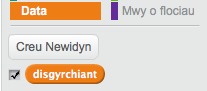

## Disgyrchiant a neidio

Fe wnawn ni wneud dy gymeriad i symud yn fwy realistig, wrth ychwanegu disgyrchiant a gadael iddynt neidio.

+ Mae'n bosib dy fod wedi sylwi bod dy gymeriad yn gallu cerdded i ffwrdd o'r platfform i ganol yr awyr. Ceisia gerdded i ffwrdd o'r platfform a gweld beth sy'n digwydd.

	

+ I drwsio hyn, fe wnawn ni ychwanegu disgyrchiant i'r gêm.  Mae angen creu newidyn newydd o'r enw `disgyrchiant`{:class="blockdata"}.  Mae modd i ti guddio'r newidyn yma o'r llwyfan os wyt ti eisiau.

	

+ Ychwanega'r bloc côd yma, sydd yn gosod y disgyrchiant i rif negatif ac yna yn defnyddio hyn i newid cyfesur-y y cymeriad.

	```blocks
		pan fo ⚑ wedi ei glicio
		gosod [disgyrchiant v] i [-4]
		am byth
   			newid y gan (disgyrchiant)
		end
	```

+ Clicia'r faner a llusga'r cymeriad i dop y dudalen.  Beth sy'n digwydd? Ydy'r disgyrchiant yn gweithio fel oeddet ti'n ei ddisgwyl?

	

+ Ni ddylai disgyrchiant symud dy gymeriad trwy platfform neu ysgol! Ychwanega bloc `os`{:class="blockcontrol"} i dy gôd, fel bod y disgyrchiant ond yn gweithio pan mae'r cymeriad yn yr aer.  Fe ddylai côd y disgyrchiant edrych fel hyn:

	```blocks
		pan fo ⚑ wedi ei glicio
			gosod [disgyrchiant v] i [-4]
			am byth
   		os <dim <<cyffwrdd lliw [#0000FF]?> neu <cyffwrdd lliw [#FF69B4]?>>> wedyn
        newid y gan (disgyrchiant)
   		end
		end
	```

+ Profa'r disgyrchiant eto. Ydy dy gymeriad yn stopio pan mae ar blatfform neu ysgol? Wyt ti'n gallu cerdded oddi ar ochr y platfform i'r lefel is?

	

+  Fe wnawn ni hefyd wneud i dy gymeriad neidio pan mae'r chwareuwr yn gwasgu'r bylchwr. Un ffordd syml iawn o wneud hyn yw symud dy gymeriad ychydig o weithiau yn defnyddio'r côd yma:

	```blocks
		pan fo bysell [bylchwr v] wedi ei wasgu
			ailwna (10)
   			newid y gan (4)
		end
	```

	Gan fod disgyrchiant yn gyson yn gwthio dy gymeriad i lawr 4 picsel, mae angen i ti ddewis rhif yn fwy na 4 yn dy floc `newid y gan (4)`{:class="blockmotion"}.  Newida'r rhif yma tan dy fod yn hapus gyda uchder neidio dy gymeriad.

+ Os wyt ti'n profi'r côd yma, fe wnei di sylwi ei fod yn gweithio ond nad yw'n llyfn iawn. I wneud y neidio edrych yn fwy llyfn, bydd angen i ti symud dy gymeriad llai a llai nes nad yw'n neidio rhagor.

+ I wneud hyn, bydd angen creu newidyn arall o'r enw `uchder neidio`{:class="blockdata"}.  Eto, mae modd newid y newidyn yma os oes well gyda ti. 

+ Dileua'r côd neidio wnes di ychwanegu i dy gymeriad, a gosod y côd yma yn ei le:

	```blocks
		pan fo bysell [bylchwr v] wedi ei wasgu
		gosod [uchder neidio v] i [8]
		ailwna hyd at <(uchder neidio) = [0]>
   			newid y gan (uchder neidio)
   			newid [uchder neidio v] gan (-0.5)
		end
	```

	Mae'r côd yma yn symud dy gymeriad fyny wrth 8 picsel, yna 7.5 picsel, yna 7 picsel, ac ati, tan fod dy gymeriad wedi gorffen neidio.  Mae hyn yn gwneud i'r neidio edrych yn llawer llyfnach.

+ Newida gwerth dechrau y newidyn `uchder neidio`{:class="blockdata"} a profa fe tan dy fod yn hapus gydag uchder neidio dy gymeriad.
