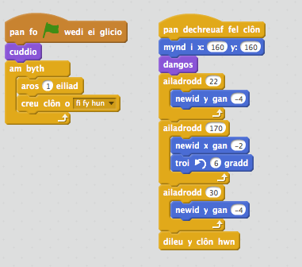

## Osgoi peli

Nawr fod dy gymeriad yn symud o gwmpas, fe awn ati i ychwanegu peli bydd yn rhaid i dy gymeriad osgoi.

+ Mae angen creu ciplun pêl. Fe alli di ddewis unrhyw fath o bêl yr hoffet ti.

	

+ Newida maint dy bêl fel bod dy gymeriad yn medru neidio drosto. Ceisia neidio dros y bêl i'w brofi.

	

+ Ychwanega'r côd yma i dy bêl:

	

	Mae'r côd yma yn creu pêl newydd bob 3 eiliad. Mae pob pêl newydd yn symud ar draws top y platfform.

+ Clicia'r faner i brofi hyn.

	

+ Ychwanega mwy o gôd i giplun dy bêl, fel eu bod yn symud ar draws y 3 platfform.

	

+ Yn olaf, bydd angen côd ar gyfer pan mae dy gymeriad yn cael ei daro gan bêl! Ychwanega'r côd yma i giplun dy bêl:

	```blocks
		pan dechreuaf fel clôn
			am byth
   			os <cyffwrdd [Pico walking v]?> wedyn
      	darlledu [hit v]
   			end
		end
	```

+ Bydd hefyd angen i ti ychwanegu côd i dy gymeriad, i symud yn ôl i'r dechrau pan mae'n cael ei daro:

	```blocks
		pan dderbyniaf [hit v]
		pwyntio i gyfeiriad (90 v)
		mynd i x:(-210) y:(-120)

	```	

+ Profa dy gymeriad a gweld os yw'n mynd nol i'r dechrau pan mae'n cael ei daro.
