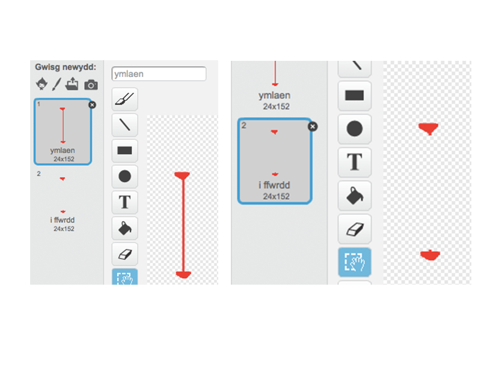

## Laser!

Fe wnawn ni wneud dy gêm ychydig yn anodd i gwblhau, trwy ychwanegu laser!

+ Ychwanega giplun newydd i dy gêm, o'r enw 'Laser',  Fe ddylai gael 2 wisg, o'r enw 'ymlaen' ac 'i ffwrdd'.

	

+ Gosoda dy laser newydd ble bynnag hoffet ti, rhwng 2 blatfform.

	

+ Ychwanega'r côd i dy laser, i wneud iddo newid rhwng y 2 wisg.

	```blocks
		pan fo ⚑ wedi ei glicio
		am byth
   			newid i wisg [ymlaen v]
   			aros (2) eiliad
   		newid i wisg [i ffwrdd v]
   		aros (2) eiliad
		end
	```

	Os oes well gyda ti, mae modd i ti `aros`{:class="blockcontrol"} cyfanswm `ar hap`{:class="blockcontrol"} o amser rhwng newid gwisg.

+ Yn olaf, ychwanega côd i dy laser, fel bod y neges 'taro' yn darlledu pan mae'r laser yn cyffwrdd dy gymeriad.  Bydd y côd yma yn debyg iawn i'r côd wnes di ychwanegu i giplun y bêl.

	Does dim angen i ti ychwanegu mwy o gôd i gy gymeriad - mae'n gwybod beth i wneud pan mae'n cael ei daro!

+ Profa dy gêm i weld os wyt ti'n gallu mynd heibio'r laser. Newida'r amser `aros`{:class="blockcontrol"} yn dy gôd os yw'r laser yn rhy hawdd neu'n rhy anodd.
