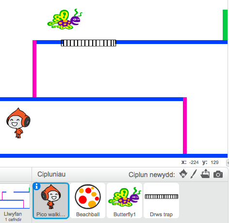

--- challenge ---
## Her: Mwy o rwystrau 
Os wyt ti dal i feddwl bod dy gêm yn rhy hawdd, mae modd i ti ychwanegu mwy o rwystrau i dy lefel. Mae modd i ti ychwanegu unrhywbeth, dyma rai syniadau:
If you think your game is still too easy, you can add more obstacles to your level. You can add anything you like, but here are some ideas:

+ Pili-pala sy'n hedfan;
+ Platfform sydd yn ymddangos a diflannu;
+ Peli tenis sydd yn rhaid osgoi.



Mae modd i ti hefyd greu mwy nag un cefndir, a symud i'r lefel nesaf pan mae dy gymeriad yn cyrraedd y drws gwyrdd:

```blocks
		os <cyffwrdd lliw [#00FF00]?> wedyn
   			newid cefndir i [cefndir nesaf v]
   			mynd i x:(-210) y:(-120)
   		aros (1) eiliad	
	end
```


--- /challenge ---