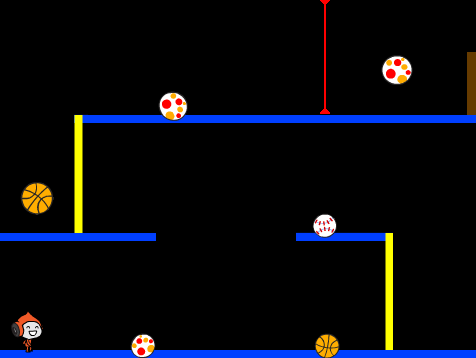

--- no-print ---

This is the **Scratch 2** version of the project. There is also a [Scratch 3 version of the project](https://projects.raspberrypi.org/de-DE/projects/dodgeball).

--- /no-print ---

## Einführung

In diesem Projekt lernst Du, wie Du ein Plattform-Spiel erstellst, in dem Du sich bewegenden Bällen ausweichen und das Ende des Levels erreichen musst.

  <iframe allowtransparency="true" width="485" height="402" src="https://scratch.mit.edu/projects/embed/39740618/?autostart=false" frameborder="0"></iframe>
  

--- collapse ---
---
title: Notizen für den Club-Leiter
---

## Einführung:
In diesem Projekt lernen Kinder, wie man ein Plattform-Spiel erstellt, indem man Scratch-Konzepte und Fähigkeiten, die in vorangehenden Projekten erlernt wurden, anwendet.

## Ressourcen
Für dieses Projekt sollte Scratch 2 verwendet werden. Scratch 2 kann entweder online genutzt werden unter [jumpto.cc/scratch-on](http://jumpto.cc/scratch-on) oder heruntergeladen werden unter [jumpto.cc/scratch-off](http://jumpto.cc/scratch-off) und dann offline verwendet werden.

Eine bereits realisierte Version dieses Projektes kann unter <a href="http://scratch.mit.edu/projects/39740618/#editor">online</a>gefunden werden. Oder es kann heruntergeladen werden, indem man auf den 'Download Project Materials'-Link für dieses Projekt klickt, welcher Folgendes enthält:

+ Dodgeball.sb2

Es steht darüber hinaus eine Version dieses Projektes mit externen Ressourcen zur Verfügung. Dies ist online unter  [jumpto.cc/dodge-resources](http://jumpto.cc/dodge-resources) erhältlich. Es ist jedoch auch in den Projekt-Materialien, die zum Download zur Verfügung stehen und Folgendes enthalten, erhältlich:

+ DodgeballResources.sb2

Dieser Link enthält auch einen 'Project Resources'-Ordner, der Bilder beinhaltet, die die Kinder zur Realisierung dieses Projektes benötigen. Es sollte sichergestellt werden, dass alle Kinder Zugriff auf diese Ressourcen haben.

Projekt-Ressourcen:
+ background.png

## Lernziele
+ Dieses Projekt konsolidiert die erlernten Fähigkeiten aus vorangehenden Projekten.

## Herausforderungen
+ "Verbessertes Springen" - Nutzung eines zusätzlichen `wenn`{:class="blockcontrol"}-Blocks, um einen Mehrfach-Sprung-Bug zu beheben;
+ "Willkürliche Bälle" - Nutzung des `Zufallszahl`{:class="blockoperators"}-Blocks, um das Kostüm des Balls, sowie die Größe und den Abstand zwischen Klonen zu variieren;
+ "Mehr Hindernisse" - Hinzufügen zusätzlicher Figuren zu dem Spiel;
+ "Verbesserte Schwerkraft" - Nutzung eines zusätzlichen `wenn`{:class="blockcontrol"}-Blocks, um einen `Schwerkraft`{:class="blockdata"}-Bug zu beheben;
+ "Mehr Leben" - Hinzufügen einer zusätzlicher `Leben`{:class="blockdata"}-Variable.

--- /collapse ---
