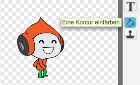

--- challenge ---
## Herausforderung: Verbesserte Schwerkraft
Es gibt einen kleinen Bug in Deinem Spiel: die Schwerkraft zieht Deine Figur nicht nach unten wenn irgendein Teil (if _any_ part) dessen, die blaue Plattform berührt - sogar wenn es sein Kopf ist!  Du kannst es testen, indem Du irgendeinen Mast heraufkletterst und die Figur dann nach links bewegst.


Kannst Du den Bug beseitigen? Um dies zu tun, musst Du Deiner Spielfigur unterschiedlich farbige Hosen geben (für allen Kostüme (on _all_ costumes))...



...und dann diesen Code ersetzen: 

```blocks
	wird Farbe [#0000FF] berührt?
```

mit:

```blocks
	Farbe [#00FF00] berührt [#0000FF]?
```

Denke daran die Verbesserung auszuprobieren, um zu testen, ob der Bug tatsächlich entfernt ist!


--- /challenge ---