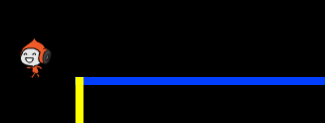
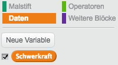

## Schwerkraft und springen

Lass uns die Bewegungen Deines Charakters relistischer erscheinen lassen, indem wir Schwerkraft hinzufügen und sie springen lassen.

+ Du hast vielleicht schon festgestellt, dass Deine Figur von einer Plattform in die Luft gehen kann. Versuche von einer Plattform zu gehen und beobachte, was passiert!

	

+ Um dies zu berictigen,lass uns Schwerkraft zu Deinem Spiel hinzufügen. Erstelle eine neue Variable names `Schwerkraft`{:class="blockdata"}. Du kannst Die Variable von der Bühne verstecken, wenn Du möchtest.

	

+ Füge diesen neuen Code-Block hinzu, welcher die Schwerkraft zu einer negativen Nummer setzt und dies nutzt, um ko,tinuierliche die y-Koodinaten Deiner Spielfigur anzupassen.

	```blocks
		Wenn die grüne Flagge angeklickt
		setze [Schwerkraft v] auf [-4]
		wiederhole fortlaufend
		   ändere y um (Schwerkraft)
		Ende
	```

+ Klicke auf die Fahen und ziehe Deine Spielfigur an die Decke der Bühne. Was passiert? Funktioniert die Schwerkraft so, wie Du es erwartet hast?

	

+ Die Schwerkraft sollte Deinen Charakter jedoch nicht durch einen Mast oder eine Plattform bewegen. Füge einen `wenn`{:class="blockcontrol"}-Block zu Deinem Code hinzu, so dass Deine Schwerkraft nur greift, wenn sich die Figur in der Luft befindet. Der Schwerkraft-Code sollte so aussehen:

	```blocks
		Wenn die grüne Flagge angeklickt
		setze [Schwerkraft v] auf [-4]
		wiederhole fortlaufend
		   falls <nicht <<wird Farbe [#0000FF] berührt?> oder <wird Farbe [#FFFF00] berührt?>>> dann
		      ändere y um (Schwerkraft)
		   Ende
		Ende
	```

+ Teste wieder die Schwerkraft. Stoppt Deine Figur wenn Sie einen Mast oder Plattform berührt? Kannst Du am Ende einer Plattform auf das untere Level heruntersteigen?

	

+  Lass uns Deine Figur zum Springen bringen, wenn der Spieler die Leertaste drückt. Du kannst auf eine einfache Weise Deine Figur einige Male hoch- und runter bewegen, indem Du diesen Code hnzufügst.

	```blocks
		Wenn Taste [Leertaste v] gedrückt
		wiederhole (10) mal
		   ändere y um (4)
		Ende
	```

	Da die Schwerkraft deine Figur kontinuierlich um 4 Pixels herunterbewegt, musst Du eine größere Zahl als 4 in Deinem `change y by (4)`{:class="blockmotion"}-Block nehmen. Verändere die Nummer so lange, bis Du zufrieden bist mit der Höhe, die Deine Spielfigur springt.

+ Wenn Du den Code testest, wirst Du feststellen, dass er funktionuert. Allerdings sind die BEwegungen nicht sehr flüssig. Um das Springen natürlicher aussehen zu lassen, musst du die BEwegungen der Figur kleiner und kleiner wwerden lassen, bis sie nicht mehr springt.

+ Um dies zu tun, erstelle eine weitere Variable, die `jump height`{:class="blockdata"} heißt. Auch hier kannst Du die Variable von der Bühne verstecken, wenn Du möchtest.

+ Lösche den Springen-Code, den Du Deinem Charakter hinzugefügt hast und ersetzte ihn stattdessen mit diesem:

	```blocks
		Wenn Taste [Leertaste v] gedrückt
		setze [jump height v] auf [8]
		wiederhole bis <(jump height) = [0]>
		   ändere y um (jump height)
		   ändere [jump height v] um (-0.5)
		Ende
	```

	Dieser Code bewegt Deinen Charakter um 8 Pixel nach oben, dann um 7.5 Pixels, dann um 7 und so weiter, bis Deine Figur nicht mehr springt. Das lässt das Springen viel flüssiger erscheinen.

+ Verändere den Startwert deiner Sprunghöhe / `jump height`{:class="blockdata"}-Variable und teste sie, bis Du zufrieden mit der Höhe, die Deine Figur springt.
