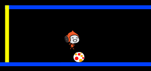

## Springende Bälle

Jetzt, da sich Deine Figur umherbewegen kann, lass uns Bälle hinzufügen, denen sie ausweichen muss.

+ Erstelle eine neue Figur. Du kannst jede Art von Ball auswählen, die Du möchtest.

	

+ Verändere die Größe des Balls, so dass Deine Spielfigur über diesen springen kann. Versuche über den Ball zu springen, um es zu testen.

	

+ Füge Deinem Ball diesen Code hinzu:

	

	Dieser Code erstellt alle 3 Sekunden einen neuen Ball-Klon. Jeder neue Klon bewegt sich entlang der oeberen Plattform.

+ Klicke auf die Fahne, um dies zu testen.

	

+ Füge dem Ball mehr Code hinzu, so dass sie sich entlang aller Plattformen bewegen.

	

+ Zum Schluss, brauchst Du einen Code, der bestimmt was passiert, wenn Deine Spielfigur von einem Ball getroffen wird! Füge diesen Code Deiner Ball-Figur hinzu:

	```blocks
		Wenn ich als Klon entstehe
		wiederhole fortlaufend
		   falls <wird [Pico walking v] berührt?> dann
		      sende [hit v] an alle
		   Ende
		Ende
	```

+ Du wirst auch Deiner Spielfigur einen Code hinzufügen, der bestimmt, dass die Figur zurück an den Start gehen muss, wenn sie getroffen worden ist:

	```blocks
		Wenn ich [hit v] empfange
		setze Richtung auf (90 v)
		gehe zu x:(-210) y:(-120)
	```	

+ Teste Deinen Spielcharakter und siehe, ob die Figur an den Start zurückversetzt wird, wenn Sie einen Ball berührt.
