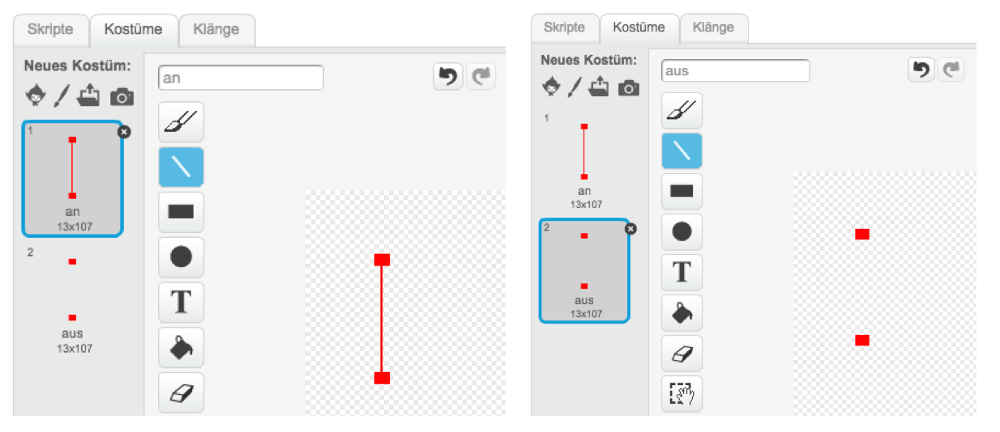
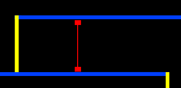

## Laser!

Lass uns Dein Spile noch schwieriger machen, indem wir Laser hinzufügen!

+ Füge Deinem Spiel eine neue Figur hinzu, die 'Laser' heißt. Sie sollte wyei Kostüme haben, die 'an' und 'aus' heißen.

	

+ Platziere Deinen Laser wo immer Du möchtest zwischen zwei Plattformen.

	

+ Füge Dinem Laser einen Code hinzu, um ihn zwischen zwei Kostümen wechseln zu lassen.

	```blocks
		Wenn die grüne Flagge angeklickt
		wiederhole fortlaufend
		   wechsle zu Kostüm [an v]
		   warte (2) Sek.
		   wechsle zu Kostüm [aus v]
		   warte (2) Sek.
		Ende
	```

	Wenn Du möchtest, kannst Du eine willkürliche / `random`{:class="blockoperators"} Zeit `warten`{:class="blockcontrol"}, bevor das Kostüm wechselt.

+ Füge anschließend Deinem Laser einen Code hinzu, so dass die 'hit'-Nachricht verbreitet wird, sobald der Laser Deine Figur berührt. Dieser Code wird der gleiche sein, den Du Deiner Ball-Figur hinzugefügt hast.

	Du musst Deiner Figur keinen weiteren Code hinzufügen - sie weiß bereits was zu tun ist, wenn sie berührt wird.

+ Teste Dein Spiel darauf, ob Du es schaffst den Laser zu passieren. Ändere die `wait`{:class="blockcontrol"}´-Zeit in Deinem Code, wenn die Laser zu einfach oder zu schwierig zu umgehen sind.

