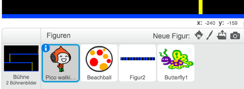

--- challenge ---
## Herausforderung: Mehr Hindernisse 
Wenn Du findest, dass Dein Spiel immer noch zu einfach ist, kannst Du Deinem Level mehr Hindernisse hinzufügen. Du kannst alles hinzufügen, was Du möchtest. Hier sind jedoch einige Ideen:

+ Einen Killer-Schmetterling;
+ Plattformen, die auftauchen und ver;
+ Falling tennis balls that must be avoided.



Du könntest sogar mehr als einen Hintergund erstellen und zum nächsten Level übergehen, sobald Deine Spielfigur die Tür erreicht hat:

```blocks
		falls <wird Farbe [#714300] berührt?> dann
		   wechsle zu Bühnenbild [nächstes Bühnenbild v]
		   gehe zu x:(-210) y:(-120)
		   warte (1) Sek.
		Ende
```


--- /challenge ---