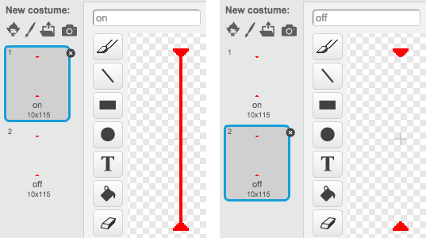

## Lasers!

To your game a little harder to complete, you are going to add lasers!

--- task ---

Add a new sprite to your game and call it `laser`. It should have two costumes: one called 'on', and one called 'off'.



--- /task ---

--- task ---

Place your new laser sprite between two platforms.


--- /task ---

--- task ---

Add code to your laser sprite to make it switch between its two costumes.


```blocks
	when flag clicked
	forever
		switch costume to [on v]
		wait (2) secs
		switch costume to [off v]
		wait (2) secs
	end
```

If you prefer, you can change the code shown above so that the sprite `waits`{:class="blockcontrol"} a `random`{:class="blockoperators"} amount of time between costume changes.

--- /task ---

--- task ---

Finally, add code to your laser sprite so that the laser sprite broadcasts a 'hit' message when it touches the character sprite. 

--- hints ---

--- hint ---

This code should be very similar to the code you added to your ball sprite.

--- /hint ---

--- hint ---

Copy the code you add to the ball sprite to make this sprite `broadcast 'hit'`{:class="blockcontrol"} when it is `touching your character`{:class="blocksensing"}.

--- /hint ---

--- hint ---

This is the code you should add:


```blocks
when green flag clicked
forever 
  if <touching [Pico walking v] ?> then 
    broadcast [hit v]
  end
end
```

--- /hint ---

--- /hints ---

You don't need to add any extra code to your characters sprite, because the character sprite already knows what to do when it receives the `broadcast 'hit'`{:class="blockcontrol"}!

--- /task ---

--- task ---

Test out your game to see if you can move the character past the laser. If the laser is too easy or too hard to avoid, change the `wait`{:class="blockcontrol"} times in the code for the laser sprite.

--- /task ---
