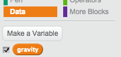
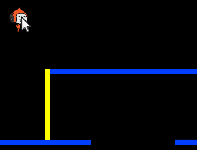

## Gravedad y saltos

Vamos a hacer que tu personaje se mueva de forma más realista añadiendo gravedad y haciendo que pueda saltar.

+ Puede que te hayas fijado en que tu personaje puede salirse de las plataformas y quedarse suspendido en medio del aire. Intenta salirte de una plataforma a ver qué pasa.

	

+ Para arreglar esto, vamos a añadir gravedad al juego. Crea una nueva variable con el nombre `gravedad`{:class="blockdata"}. Si quieres, puedes esconder esta variable del escenario.

	

+ Añade este nuevo bloque de código, que fija la gravedad en un número negativo, y de esta manera cambia la coordenada y del personaje continuamente.

	```blocks
		al presionar bandera verde
		fijar [gravedad v] a [-4]
		por siempre
			cambiar y por (gravedad)
		fin
	```

+ Presiona la bandera y arrastra a tu personaje hasta la parte superior del escenario. ¿Qué ocurre? ¿La gravedad funciona como esperabas?

	

+ ¡La gravedad no debería hacer caer a tu personaje de las plataformas o de un poste! Añade un bloque `si`{:class="blockcontrol"} al código para que la gravedad sólo funcione cuando el personaje esté en medio del aire. El código de gravedad debería ser así:

	```blocks
		al presionar bandera verde
		fijar [gravedad v] a [-4]
		por siempre
			si <no <<¿tocando el color [#0000FF]?> o <¿tocando el color [#FFFF00]?>>> entonces
				cambiar y por (gravedad)
			fin
		fin
	```

+ Prueba la gravedad otra vez. ¿Se cae tu personaje cuando está en una plataforma o en un poste? ¿Puedes dejarte caer del borde de las plataformas al nivel inferior?

	

+  También vamos a hacer que tu personaje salte cuando el jugador pulse la tecla de espacio. Una forma muy sencilla de hacer esto es mover al personaje hacia arriba unas cuantas veces, usando este código:

	```blocks
		al presionar tecla [espacio v]
		repetir (10)
			cambiar y por (4)
		fin
	```

	Como la gravedad está constantemente empujando a tu personaje 4 píxeles hacia abajo, necesitarás indicar un número superior a 4 en el bloque `cambiar y por (4)`{:class="blockmotion"}. Cambia el número hasta que te parezca bien la altura a la que el personaje salta.

+ Si pruebas este código verás que funciona bien, pero el movimiento no es demasiado fluido. Para que los saltos parezcan más naturales, tendrás que mover al personaje en cantidades cada vez más pequeñas, hasta que deje de saltar.

+ Para conseguir esto, crea otra variable llamada `altura de salto`{:class="blockdata"}. De nuevo, puedes esconder esta variable si lo prefieres.

+ Elimina el código de salto que has añadido a tu personaje, y sustitúyelo por éste:

	```blocks
		al presionar tecla [espacio v]
		fijar [altura de salto v] a [8]
		repetir hasta que <(altura de salto) = [0]>
			cambiar y por (altura de salto)
			cambiar [altura de salto v] por (-0.5)
		fin
	```

	Este código hace que el personaje se mueva hacia arriba 8 píxeles, después 7,5 píxeles, después 7 píxeles, y así hasta que el personaje acabe de saltar. Esto hará que el salto parezca mucho más fluido.

+ Cambia el valor de inicio de la variable `altura de salto`{:class="blockdata"} y prueba hasta que te parezca bien la altura a la que el personaje salta.
