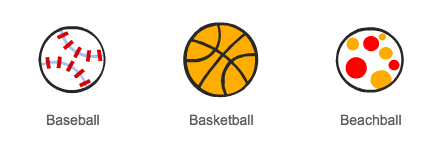
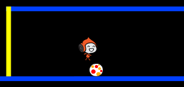
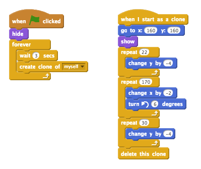
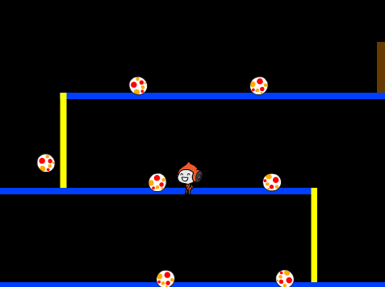

## Esquivar los balones

Ahora que has conseguido que el personaje se mueva, vamos a añadir los balones que el personaje tendrá que esquivar.

+ Crea un nuevo objeto balón. Puedes escoger el tipo de balón que más te guste.

	

+ Cambia el tamaño del balón para que el personaje pueda saltar por encima de él. Intenta saltar sobre el balón para probarlo.

	

+ Añade este código al balón:

	

	Este código crea un nuevo clon del balón cada 3 segundos. Cada nuevo balón se desplaza a lo largo de la plataforma superior.

+ Presiona la bandera para probar el código.

	

+ Añade más código al objeto balón para que los balones se muevan a lo largo de las tres plataformas.

	

+ Para terminar, ¡necesitarás código para cuando un balón toque al personaje! Añade este código al objeto balón:

	```blocks
		al comenzar como clon
		por siempre
			si <¿tocando [Pico walking v]?> entonces
				enviar [tocado v]
			fin
		fin
	```

+ También tendrás que añadir este código al personaje, para que vuelva al principio cuando un balón le toque:

	```blocks
		al recibir [tocado v]
		apuntar en dirección (90 v)
		ir a x:(-210) y:(-120)
	```

+ Haz una prueba con el personaje para ver si vuelve al principio cuando un balón le toca.
