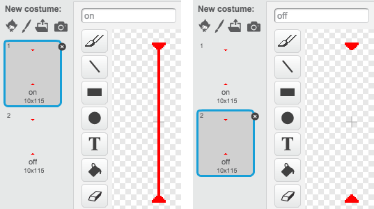

## ¡Láseres!

¡Vamos a añadir láseres para que sea un poco más difícil acabar el juego !

+ Añade un nuevo objeto al juego, con el nombre 'Láser'. Debería tener 2 disfraces, llamados 'on' y 'off'.

	

+ Coloca tu nuevo láser donde quieras, entre dos plataformas.

	

+ Añade código al láser para que cambie entre los dos disfraces.

	```blocks
		al presionar bandera verde
		por siempre
			cambiar disfraz a [on v]
			esperar (2) segundos
			cambiar disfraz a [off v]
			esperar (2) segundos
		fin
	```

	Si lo prefieres, puedes `esperar`{:class="blockcontrol"} un tiempo `al azar`{:class="blockoperators"} entre el cambio de disfraces.

+ Para finalizar, añade código al láser para que el mensaje 'tocado' se envíe cuando el láser toque al personaje. Este código es el mismo que el que has añadido al objeto balón.

	No necesitas añadir más código al personaje, ¡ya sabe lo que tiene que hacer cuando algo le toca!

+ Prueba el juego para ver si eres capaz de pasar a través del láser. Cambia los tiempos en el código `esperar`{:class="blockcontrol"} si los láseres son demasiado fáciles o difíciles.
