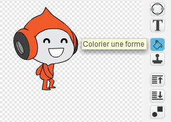

--- challenge ---
## Défi : gravité améliorée 
Il y a un autre petit bogue dans votre jeu : la gravité ne tire pas votre personnage vers le bas si n'importe quelle de ses parties touchent une plateforme bleue ! Vous pouvez tester cela en montant sur une échelle et en vous déplaçant ensuite à gauche.


Pouvez-vous corriger ce bogue ? Pour faire cela, vous devez changer la couleur du pantalon de votre personnage (Sur tous les costumes)...



... et remplacez ensuite le code:

```blocks
	< couleur [#0000FF] touchée? >
```

avec:

```blocks
	< couleur [#00FF00] touche [#0000FF]? >
```

N'oubliez pas de tester vos améliorations pour vous assurer que vous avez corrigé le bogue!


--- /challenge ---