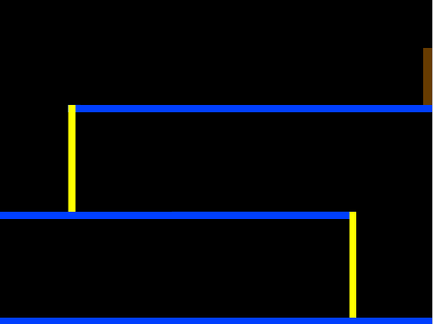
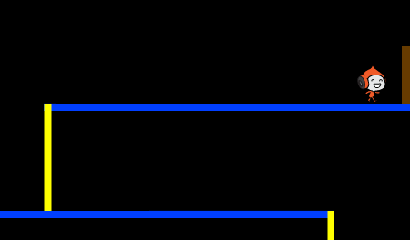

## Mouvement du personnage

Commençons par créer un personnage qui peut se déplacer à gauche et à droite et monter sur des échelles.

+ Commencez un nouveau projet de Scratch et supprimez le lutin de chat pour que votre projet soit vide. Vous pouvez trouver l'éditeur de Scratch en ligne à <a href="http://jumpto.cc/scratch-new">jumpto.cc/scratch-new</a>.

+ Pour ce projet, vous devriez avoir un dossier de 'Ressources du Projet', contenant toutes les images dont vous aurez besoin. Assurez-vous que vous pouvez trouver ce dossier et demander à votre leader de club si vous ne trouvez pas cela.

	

+ Ajoutez l'image 'background.png' comme nouveau fond de scène ou dessinez le vôtre! Si vous dessinez votre propre niveau, assurez-vous que les échelles et les planchers sont d'une couleur différente et qu'il y a une porte (ou quelque chose de semblable) que votre joueur doit atteindre. Voici ce que votre projet doit ressembler :

	

+ Ajoutez un nouveau lutin qui sera votre personnage. Cela serait préférable si vous choisissez un lutin avec plusieurs costumes pour que vous puissiez le faire marcher.

	

+ Utilisons les touches de direction pour déplacer votre personnage. Quand le joueur appuie sur la flèche droite, vous voulez que votre personnage pointe à droite, se déplace de quelques pas et change de costume:

	```blocks
		quand le drapeau vert pressé
		répéter indéfiniment
   			si <touche [flèche droite v] pressée?> alors
     			s'orienter à (90 v)
      			avancer de (3)
      			costume suivant
   			fin
		fin
	```

+ Testez votre personnage en cliquant sur le drapeau et maintenez la touche de direction droite. Votre joueur se déplace-t-il à droite ? Votre personnage marche-t-il ?

	

+ Pour déplacer votre personnage vers la gauche, vous devrez ajouter un autre `si`{:class="blockcontrol"} à l'intérieur de votre `répéter indéfiniment`{:class="blockcontrol"} pour déplacer votre personnage à gauche. Rappelez-vous de tester votre nouveau code pour vous assurer ça marche !

+ Pour monter une échelle rose, votre personnage devrait avancer légèrement en haut quand la flèche du haut est appuyée et qu'il touche la bonne couleur. Ajoutez ce code à l'intérieur de la boucle `répéter indéfiniment`{:class="blockcontrol"} de votre personnage :

	```blocks
		si <<touche [flèche haut v] pressée?> et <couleur [#FFFF00] touchée?>> alors
   			ajouter (4) à y
		fin
	```

+ Testez votre personnage - pouvez-vous monter sur les échelles roses et arriver à la fin de votre niveau ?

	
