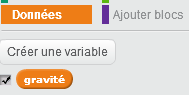

## Gravité et saut 

Déplaçons votre personnage plus réellement en ajoutant de la gravité et en lui permettant de sauter.

+ Vous pouvez remarquer que votre personnage peut s'éloigner d'une plateforme dans les airs. Essayez de marcher hors d'une plateforme et regardez ce qu'il se produit.

	

+ Pour régler cela, ajoutons de la gravité à votre jeu. Créez une nouvelle variable appelée `Gravité`{:class="blockdata"}. Vous pouvez cacher cette variable de votre scène si vous voulez.

	

+ Ajoutez ce nouveau bloc de code ce qui ajuste la gravité à un nombre négatif. Celui-ci sera ensuite utilisé à plusieurs reprises pour changer la coordonnée Y de votre personnage.

	```blocks
		quand le drapeau vert pressé
		mettre [gravity v] à [-4]
		répéter indéfiniment
   			ajouter (gravity) à y
		fin
	```

+ Cliquez sur le drapeau et traînez ensuite votre personnage au sommet de la scène. Qu'est-ce qui arrive ? La gravité marche-t-elle ?

	

+ La gravité ne devrait pas déplacer votre personnage à travers une plateforme ou une échelle! Ajoutez un bloc `si`{:class="blockcontrol"} à votre code pour que la gravité puisse marcher seulement quand votre personnage est dans les airs. Le code de gravité devrait maintenant ressembler à ceci :

	```blocks
		quand le drapeau vert pressé
		mettre [gravity v] à [-4]
		répéter indéfiniment
  			si <non <<couleur [#FFFF00] touchée?> ou <couleur [#FF69B4] touchée?>>> alors
      			ajouter (gravity) à y
   			fin
		fin
	```

+ Testez la gravité de nouveau. Votre personnage s'arrête-t-il quand il est sur une plateforme ou une échelle ? Pouvez-vous vous éloignez du bord des plateformes et atterir sur le niveau ci-dessous ?

	

+  Faisons aussi un saut lorsque le joueur appuie sur la barre d'espace. Il suffit uniquement de déplacer votre personnage en haut à plusieurs reprises en utilisant ce code :

	```blocks
		quand [space v] est pressé
		répéter (10) fois
			ajouter (4) à y
		end
	```

	Comme la gravité pousse constamment votre personnage en bas par 4 pixels, vous devez choisir un nombre plus grand que 4 dans votre `Changer y par (4)`{:class="blockmotion"}. Changez ce nombre jusqu'à ce que vous soyez heureux avec la hauteur de vos sauts.


+ Si vous testez ce code, vous remarquerez que ça marche, mais le mouvement n'est pas très cohérent. Pour améliorer cela, vous devrez déplacer votre personnage par des quantités de plus en plus petites jusqu'à ce qu'il ne saute plus.

+ Pour ceci faire, créez une autre variable appelée `hauteur saut`{:class="blockdata"}. Vous pouvez cacher cette variable encore un fois si vous préférez.

+ Supprimez le premier code de saut que vous avez ajouté à votre personnage et remplacez-le par ce code :

	```blocks
		quand [espace v] est pressé
		mettre [jump height v] à [8]
		répéter jusqu’à <(jump height) = [0]>
   			ajouter (jump height) à y
   			ajouter à [jump height v] (-0.5)
		fin
	```

	Ce code déplace votre personnage vers le haut par 8 pixels, 7.5 pixels, 7 pixels, etc... jusqu'à ce que votre personnage ait fini de sauter.

+ Changez la valeur de départ de votre `hauteur saut`{:class="blockdata"} et testez jusqu'à ce que vous soyez heureux avec la hauteur de vos sauts.
