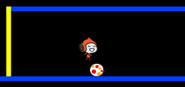
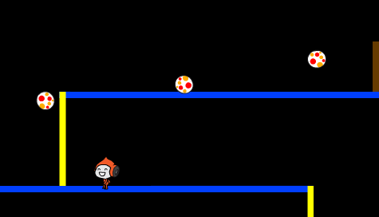

## Esquive des balles

Maintenant que vous avez votre déplacement de personnage, ajoutons quelques balles que votre personnage puisse éviter.

+ Créez un nouveau lutin de balle. Vous pouvez choisir n'importe quel type de balle que vous aimez.

	

+ Redimensionnez votre balle pour que votre personnage puisse y sauter par-dessus. Essayez de sauter par-dessus la balle pour le tester.

	

+ Ajoutez ce code à votre balle :

	

	Ce code crée une nouvelle balle à chaque 3 secondes. Chaque nouveau clone avance tout au long de la plateforme supérieure.

+ Cliquez sur le drapeau pour tester ceci.

	

+ Ajoutez plus de codage à votre lutin de balle pour qu'ils traversent sur toutes les 3 plateformes.

	

+ Finalement, vous aurez besoin d'un code pour les fois où votre personnage sera frappé par une balle! Ajoutez ce code à votre lutin de balle :

	```blocks
		quand je commence comme un clone
		répéter indéfiniment
   			si <[Pico walking v] touché?> alors
      			envoyer à tous [hit v]
   			fin
		fin
	```

+ Vous devrez aussi ajouter ce code à votre personnage afin qu'il retourne à la position initiale lorsqu'il est frappé:

	```blocks
		quand je reçois [hit v]
		s'orienter à (90 v)
		aller à x:(-210) y:(-120)
	```

+ Testez votre personnage et vérifiez s'il retourne au début lorsqu'il est frappé par une balle.
