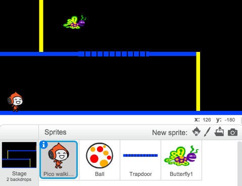

--- challenge ---
## Défi : Plus d'obstacles 
Si vous pensez que votre jeu est trop facile, vous pouvez ajouter plus d'obstacles à votre niveau. Vous pouvez ajouter tout ce que vous souhaitez, mais voici quelques idées :

+ Un papillon tueur volant;
+ Des plateformes qui apparaissent et disparaissent;
+ Une chute des balles de tennis qui doivent être évitées.



Vous pourriez même créer plus qu'un fond et vous déplacer vers le niveau suivant lorsque votre personnage atteint la porte verte :

```blocks
	Si <couleur [#714300] touchée?> alors
		basculer sur l'arrière-plan [next backdrop v]
		aller à x: (-210) y: (-120)
		attendre (1) secondes
	end
```


--- /challenge ---