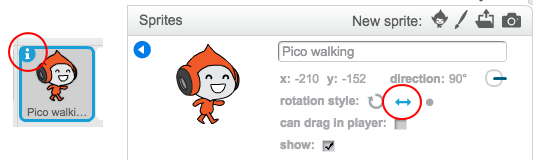

## कैरेक्टर की गति

आइए हम, ऐसा कैरेक्टर बनाने से आरंभ करें, जो उपर नीचे गति कर सके, और साथ ही सीढ़ी पर चढ़ सके। 


+ ऑनलाइन <a href="http://jumpto.cc/dodge-go" target="_blank">jumpto.cc/dodge-go</a> पर 'डॉजबॉल' Scratch प्रोजेक्ट खोलें या <a href="http://jumpto.cc/dodge-get" target="_blank">jumpto.cc/dodge-get</a> से डाउनलोड करें और फिर इसे खोलें यदि आप ऑफ़लाइन एडिटर उपयोग कर रहे हैं।

	इस प्रोजेक्ट में निम्नलिखित प्लेटफॉर्म्स वाली पृष्ठभूमि शामिल होती है:

	

+ नया स्प्राइट जोड़ें, जो आपका कैरेक्टर होगा। यह अच्छा होता है यदि आप कई पोशाकों के साथ स्प्राइट चुनते हैं, ताकि आप इसे ऐसा बना सकें कि यह चलता हुआ प्रतीत हो।

	

+ चलिए आपके कैरेक्टर को गति करवाने के लिए तीर कुंजियों का उपयोग करें। जब खिलाड़ी दायाँ तीर दबाता है, तो आप चाहते हैं कि आपका कैरेक्टर दाईं ओर मुड़ जाए, कुछ कदम चलें और अगली पोशाक बदल ले:

	```blocks
		जब ⚑ क्लिक किया गया हो
		हमेशा के लिए
end
			अगर <[दायाँ तीर v] बटन दबाया है?> हो तो
end
				(90 v) की दिशा में देखे
				(3) कदम चले
				अगली पोशाक
			end
		end
	```

+ फ्लैग पर क्लिक करके और दाईं तीर कुंजी को दबाए रखकर अपने कैरेक्टर का परीक्षण करें। क्या आपका खिलाड़ी दाईं और गति करता है? क्या आपका कैरेक्टर ऐसा दिखाई देता है कि वह चल रहा है?

	

+ अपने कैरेक्टर को बाईं ओर गति करवाने के लिए, आपको अपने `हमेशा के लिए`{:class="blockcontrol"} लूप में अन्य `अगर`{:class="blockcontrol"} ब्लॉक जोड़ना होगा, जो आपके कैरेक्टर को बाईं ओर गति करवाता है।

+ यह देखने के लिए अपने कोड का परीक्षण करें कि यह सही काम करता है। क्या आपका कैरेक्टर बाईं ओर चलते समय उल्टा हो जाता है?

	

	यदि ऐसा होता है, तो आप अपने कैरेक्टर स्प्राइट पर `(i)`{:class="blocksensing"} आइकन पर क्लिक करके और फिर बाईं तीर कुंजी को दबाकर इस त्रुटि को ठीक कर सकते हैं।

	

	या, यदि आप चाहें तो आप इस ब्लॉक को अपने कैरेक्टर की स्क्रिप्ट के आरंभ में जोड़ सकते हैं:

	```blocks
	रोटेशन की शैली [left-right v] पर सेट करे
	```

+ गुलाबी सीढ़ी पर चढ़ने के लिए, आपके कैरेक्टर को कुछ उपर की और गति करनी होगी, जब भी उपर का तीर दबाया जाता है और वे सही रंग को छूते हैं। इस कोड को अपने कैरेक्टर के `हमेशा के लिए`{:class="blockcontrol"} लूप के भीतर जोड़ें:

	```blocks
		अगर <<[ऊपर का तीर v] बटन दबाया है?> और <[#FF69B4] रंग को छू रहा है?>> हो तो
end
			(4) से y बदले
		End
	```

+ अपने कैरेक्टर का परीक्षण – क्या आप गुलाबी सीढ़ी पर चढ़ सकते हैं और अपने लेवल के अंत तक पहुँच सकते हैं?

	


