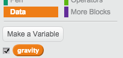

## गुरुत्वाकर्षण और छलांग

चलिए, गुरुत्वाकर्षण जोड़कर और कैरेक्टर को छलांग लगाने की अनुमति देकर ऐसा करें कि आपका कैरेक्टर गति करते समय अधिक वास्तविक लगे।


+ शायद आपने ध्यान दिया होगा कि आपका कैरेक्टर प्लेटफॉर्म से हवा में उड़ सकता है। प्लेटफॉर्म से दूर होने का प्रयास करें और देखें कि क्या होता है।

	

+ इसे ठीक करने के लिए, चलिए आपकी गेम में गुरुत्वाकर्षण जोड़ें। `गुरुत्वाकर्षण`{:class="blockdata"} नामक नया वेरिएबल बनाएँ। यदि आप चाहें, तो आप इस वेरिएबल को अपनी स्टेज से छिपा सकते हैं।

	

+ यह नया कोड ब्लॉक जोड़ें, जो गुरुत्वाकर्षण को ऋणात्मक संख्या पर सेट करता है, और फिर आपके कैरेक्टर के y-निर्देशांक को निरंतर बदलने के लिए इसका उपयोग करता है।

	```blocks
		जब ⚑ क्लिक किया गया हो
		[गुरुत्वाकर्षण v] पर [-4] सेट करे
		हमेशा के लिए
end
			(गुरुत्वाकर्षण) से y बदले
		end
	```

+ फ्लैग पर क्लिक करें, और फिर अपने कैरेक्टर को स्टेज के शीर्ष पर खींचें। क्या होता है? क्या गुरुत्वाकर्षण वैसे ही काम करता है, जैसा आपने सोचा था?

	

+ गुरुत्वाकर्षण को आपके कैरेक्टर को प्लेटफॉर्म या सीढ़ी से स्थानांतरित नहीं करना चाहिए! अपने कोड में `अगर`{:class="blockcontrol"} ब्लॉक जोड़ें, ताकि गुरुत्वाकर्षण केवल तभी काम करे, जब आपका कैरेक्टर हवा में हो। गुरुत्वाकर्षण कोड ऐसा दिखना चाहिए:

	```blocks
		जब ⚑ क्लिक किया गया हो
		[गुरुत्वाकर्षण v] पर [-4] सेट करे
		हमेशा के लिए
end
			अगर <<<[#0000FF] रंग को छू रहा है?> या <[#FF69B4] रंग को छू रहा है?>> नहीं ।> हो तो
end
				(गुरुत्वाकर्षण) से y बदले
			End
		End
	```

+ गुरुत्वाकर्षण का पुनः परीक्षण करें। क्या आपका कैरेक्टर रुक जाता है, जब वह प्लेटफॉर्म या सीढ़ी पर होता है? क्या आप प्लेटफॉर्म के किनारे से नीचे लेवल जा सकते हैं?

	

+ चलिए खिलाड़ी द्वारा स्पेसबार दबाने पर, कैरेक्टर से छलांग लगवाएं। ऐसा करने का एक सबसे सरल तरीका यह है कि इस कोड द्वारा आपके कैरेक्टर को कई बार उपर स्थानांतरित किया जाए:

	```blocks
		जब  [स्पेस v] बटन दबा हुआ है
		(10) बार दोहराएं
end
			(4) से y बदले
		End
	```

	चूँकि गुरुत्वाकर्षण आपके कैरेक्टर को निरंतर 4 पिक्सल नीचे की ओर धकेलता है, इसलिए आपको अपने `(4) से y बदले`{:class="blockmotion"} ब्लॉक में 4 से बड़ी संख्या चुननी चाहिए। इस संख्या को तब तक बदलें, जब तक आप अपने कैरेक्टर की छलांग की उंचाई से ख़ुश न हो जाएँ।

+ यदि आप इस कोड का परीक्षण करते हैं, तो आप देखेंगे कि यह काम करता है, परन्तु गति बहुत अच्छी नहीं है। छलांग को अधिक सहज दिखाने के लिए, आपको अपने कैरेक्टर को छोटी-छोटी मात्रा में स्थानांतरित करना चाहिए, जब तक वह छलांग लगाना बंद नहीं कर देता।

+ ऐसा करने के लिए, `जंप हाइट`{:class="blockdata"} नामक अन्य वेरिएबल बनाएँ। पुनः, यदि आप चाहें तो आप इस वेरिएबल को छिपा सकते हैं।

+ आपने अपने कैरेक्टर में छलांग के कोड जो कोड शामिल किया है, उसे हटा दें, और इसे इस कोड से बदल दें:

	```blocks
		जब  [स्पेस v] बटन दबा हुआ है
		[जंप हाइट v] पर [8] सेट करे
		<(जंप हाइट) = [0]> तक दोहराते रहे
end
			(जंप हाइट) से y बदले
			[जंप हाइट v] से (-0.5) बदले
		end
	```

	यह कोड आपके कैरेक्टर को 8 पिक्सल, फिर 7.5 पिक्सल, फिर 7 पिक्सल, और आगे ऐसे ही उपर गति करता है, जब तक आपका कैरेक्टर छलांग लगाना समाप्त नहीं करता। इससे छलांग और सहज दिखाई देती है।

+ अपने `जंप हाइट`{:class="blockdata"} वेरिएबल का मान बदलें और तब तक परीक्षण करें जब तक आप अपने कैरेक्टर की छलांग की उंचाई से ख़ुश न हो जाएँ।


