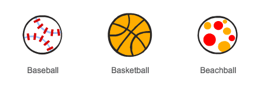
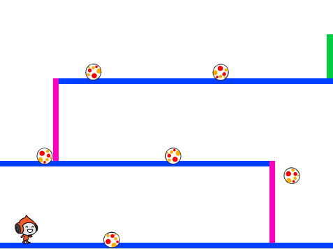

## डॉजिंग बॉल्स

अब जबकि आपका कैरेक्टर चारों ओर घूम रहा है, तो चलिए आपके कैरेक्टर के लिए कुछ बॉल्स जोड़ें, जिनसे इसे बचना होगा।


+ नया बॉल स्प्राइट बनाएँ। आप अपनी इच्छा से किसी भी प्रकार की बॉल चुन सकते हैं।

	

+ अपनी बॉल का आकार बदलें, ताकि आपका कैरेक्टर इस पर छलांग लगा सके। इसका परीक्षण करने के लिए, बॉल के उपर से छलांग लगाने का प्रयास करें। 

	

+ यह कोड अपनी बॉल में जोड़ें:

	

	यह कोड हर 3 सेकंड में नया बॉल क्लोन बनाता है। प्रत्येक नया क्लोन शीर्ष प्लेटफॉर्म के साथ गति करता है।

+ इसके परीक्षण के लिए फ्लैग पर क्लिक करें।

	

+ अपने बॉल स्प्राइट में और कोड जोड़ें, ताकि वे सभी 3 प्लेटफॉर्म्स में गति करें।

	

+ अंततः, आपको कोड की ज़रूरत है कि आपका कैरेक्टर बॉल से कब टकराएगा! यह कोड अपने बॉल स्प्राइट में जोड़ें:

	```blocks
		मेरे एक क्लोन के रूप में शुरू होने पर
		हमेशा के लिए
end
			अगर <[Pico walking v] को छू रहा है?> हो तो
end
				[hit v] प्रसारण करें
			end
		end
	```

+ आपको अपने कैरेक्टर में भी कोड जोड़ना होगा, ताकि जब वे टकराएं तो वापस मूल स्थिति में आ जाएँ।

	```blocks
		मुझे [hit v] मिलने पर
    (90 v) की दिशा में देखे
    x: (-210) y: (-120) पर जा
	```	

+ अपने कैरेक्टर का परीक्षण करें और देखें कि क्या वे बॉल से टकराने पर अपनी मूल स्थिति में वापस आ चले जाते हैं।


