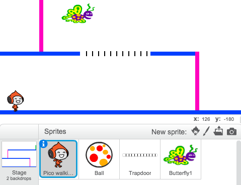

--- challenge ---
## चुनौती: और रुकावटें
यदि आपको लगे कि आपका गेम अभी भी बहुत आसान है, तो आप अपने लेवल पर और रुकावटें जोड़ सकते हैं। आप अपनी इच्छा से कुछ भी जोड़ सकते हैं, परन्तु कुछ विचार इस प्रकार हैं:

+ उड़ने वाली कातिल तितली;
+ ऐसे प्लेटफॉर्म जो गायब हो जाते हैं, और दिखाई देने लगते हैं;
+ गिरने वाली टेनिस बॉल्स, जिनसे बचना है।



यहाँ तक कि आप एक से अधिक बैकड्रॉप भी बना सकते हैं, और जब आपका कैरेक्टर हरे दरवाज़े तक पहुँचता है, तो अगले लेवल की ओर बढ़ सकते हैं:

```blocks
	अगर <[#00FF00] रंग को छू रहा है?> हो तो
end
		पृष्ठभूमि बदल कर [अगली पृष्ठभूमि v] करें
		x:(-210) y:(-120) पर जाएँ
		(1) सेकेंड तक ठहरे
	end
```


--- /challenge ---