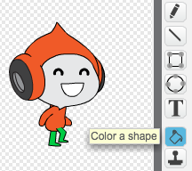

--- challenge ---
## Sfida: Salto migliorato
Nel tuo gioco c'è un altro piccolo bug: la gravità non spinge in basso il personaggio se_qualsiasi_delle sue parti tocca una piattaforma blu - inclusa la testa! Puoi fare la prova salendo una scala quasi fino in cima e poi muovendoti a sinistra.


Puoi risolvere questo bug? Per farlo, dovrai dare al personaggio dei pantaloni di colore diverso (su _tutti_ gli costumi)...



...e poi sostituisci il codice:

```blocks
	<sta toccando il colore [#0000FF]>
```

con:

```blocks
	<il colore [#00FF00] sta toccando il colore [#0000FF]>
```

Ricordati di provare le modifiche apportate per assicurarti che il bug sia risolto!


--- /challenge ---