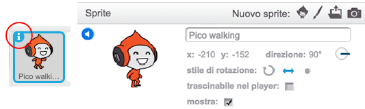

## Movimento del personaggio

Iniziamo creando un personaggio che può muoversi a destra e a sinistra, e anche salire le scale.

+ Apri il progetto Scratch online 'Dodgeball' a <a href="http://jumpto.cc/dodge-go" target="_blank">jumpto.cc/dodge-go</a> o scaricalo da <a href="http://jumpto.cc/dodge-get" target="_blank">jumpto.cc/dodge-get</a> e poi apri se stai usando l'editore offline.

	Il progetto contiene uno sfondo con piattaforme:

	

+ Aggiungi un nuovo sprite che sarà il tuo personaggio. È meglio se scegli uno sprite che abbia molteplici costumi, in modo che tu possa farlo apparire come se stesse camminando.

	

+ Usiamo i tasti freccia per muovere il personaggio. Quando il giocatore preme la freccia destra, vogliamo che il personaggio punti a destra, si muova di qualche passo e cambi al prossimo costume:

	```blocks
		quando si clicca sulla bandiera verde
		per sempre
  			se <tasto [freccia destra v] premuto> allora
   				punta in direzione (90 v)
    			fai (3) passi
    			passa al costume seguente
  			end
		end
	```

+ Prova il tuo personaggio cliccando la bandiera e poi tenendo premuta la freccia destra. Il tuo giocatore si muove verso destra? Sembra che il tuo personaggio stia camminando?

	

+ Per muovere il tuo personaggio a sinistra, dovrai aggiungere un altro blocco `se`{:class="blockcontrol"} dentro il loop `per sempre`{:class="blockcontrol"}, che muove il tuo personaggio a sinistra.

+ Prova il tuo nuovo codice per assicurarti che funzioni. Il tuo personaggio si capovolge quando cammina a sinistra?

	

	In quel caso, puoi risolvere questo bug cliccando l'icona `(i)`{:class="blocksensing"} sullo sprite del personaggio, e poi clicca le frecce dstra-sinistra.

	

	Oppure, se preferisci, puoi aggiungere questo blocco all'inizio del testo del tuo personaggio:

	 ```blocks
	   porta stile rotazione a [sinistra-destra v]
	 ```

+ Per salire una scala rosa, il tuo personaggio dovrebbe muoversi leggermente verso l'alto ogni volta che la freccia in su è premuta e sta toccando il colore corretto. Aggiungi questo codice dentro il loop `per sempre`{:class="blockcontrol"} del tuo personaggio:

	```blocks
		se <<tasto [freccia su v] premuto> e <sta toccando il colore [#FF69B4]>> allora
  			cambia y di (4)
		end
	```

+ Prova il personaggio - riesci a salire le scale rosa e a raggiungere la fine del livello?

	
