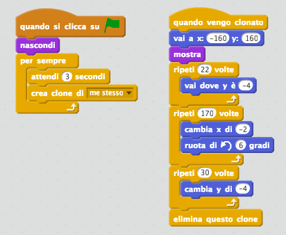

## Palle da schivare

Adesso che sei riuscito a far muovere il tuo personaggio, aggiungiamo delle palle che deve evitare.

+ Crea un nuovo sprite per la palla. Puoi scegliere il tipo di palla che desideri.

	

+ Ridimensiona la palla in modo che il tuo personaggio possa saltare oltre essa. Prova a saltare oltre la palla per vedere se funziona.

	

+ Aggiungi questo codice alla tua palla:

	

	Questo codice crea un nuovo clone di palla ogni 3 secondi. Ogni nuovo clone si muove lungo la piattaforma superiore.

+ Clicca sulla bandiera per provare.

	

+ Aggiungi un altro codice allo sprite della palla in modo che possa muoversi in tutte e 3 le piattaforme.

	

+ Infine, ti servirà un codice per quando il personaggio viene colpito ('hit') da una palla! Aggiungi questo codice allo sprite della palla:

	```blocks
		quando vengo clonato
		per sempre
  			se <sta toccando [Pico walking v]> allora
    			invia a tutti [hit v]
  			end
		end
	```

+ Dovrai aggiungere anche un codice al personaggio per farlo tornare all'inizio quando viene colpito:

	```blocks
		quando ricevo [hit v]
		punta in direzione (90 v)
		vai a x: (-210) y: (-120)
	```

+ Prova il tuo personaggio e vedi se ritorna all'inizio quando viene colpito da una palla.
