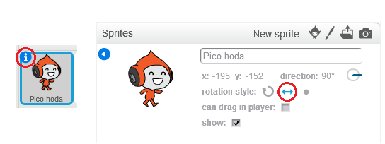

## Kretanje karaktera

Počnimo tako što ćemo kreirati karaktera koji može da se kreće lijevo i desno, kao i da se penje uz ljestve.

+ Otvori Scratch projekat 'Dodgeball' online na <a href="http://jumpto.cc/dodge-go" target="_blank">jumpto.cc/dodge-go</a>{:target="_blank"} ili ga preuzmi sa <a href="http://jumpto.cc/dodge-get" target="_blank">jumpto.cc/dodge-get</a>{:target="_blank"}, a zatim otvori ako koristiš offline editor.
    
    Projekat sadrži pozadinu sa platformama:
    
    

+ Dodaj novi lik (sprite) koji će biti tvoj karakter. Bolje je da izabereš lik sa više kostima (costumes), tako da možeš da napraviš da lik izgleda kao da hoda.
    
    

+ Koristićemo tastere sa strelicama za pomjeranje tvog karaktera. Kada igrač pritisne strelicu udesno (presses the right arrow), tvoj karakter treba da se okrene udesno (point right), ide nekoliko koraka (move a few steps) i promijeni kostim (change to the next costume):
    
    ```blocks
        when flag clicked
        forever
            if <key [right arrow v] pressed? > then
                point in direction (90 v)
                move (3) steps
                next costume
            end
        end
    ```

+ Isprobaj svog karaktera tako što ćeš kliknuti na zastavicu, a zatim držati pritisnut taster sa strelicom udesno. Da li se tvoj igrač kreće udesno? Da li tvoj karakter izgleda kao da hoda?
    
    

+ Za pomjeranje tvog karaktera ulijevo, potrebno je da dodaš još jedan blok `if`{:class="blockcontrol"} (ako) unutar petlje `forever`{:class="blockcontrol"} (ponavljaj).

+ Isprobaj svoj novi kôd da provjeriš da li funkcioniše. Da li se tvoj karakter okreće naglavačke kada ide ulijevo?
    
    
    
    Ako je tako, možeš da popraviš ovu grešku tako što ćeš kliknuti na ikonu `(i)`{:class="blocksensing"} na liku karaktera, a zatim kliknuti na strelicu lijevo-desno.
    
    
    
    Ili, ako ti više odgovara, možeš da dodaš sljedeći blok na početak skripte (script) svog karaktera:
    
    ```blocks
        set rotation style [left-right v]
    ```

+ Da se popenje uz ružičaste ljestve, tvoj karakter treba polako da se pomjera prema gore svaki put kada je pritisnuta strelica nagore i kada dodiruje ispravnu boju. Dodaj ovaj kôd unutar petlje `forever`{:class="blockcontrol"} (ponavljaj) svog karaktera:
    
    ```blocks
        if < <key [up arrow v] pressed?> and <touching color [#FF69B4]?> > then
            change y by (4)
        end
    ```

+ Isprobaj svog karaktera - da li možeš da se popenješ uz ružičaste ljestve i da dođeš do kraja nivoa?
    
    
