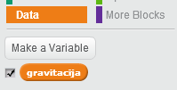

## Gravitacija i skokovi

Napravimo da kretanje tvog karaktera izgleda realnije, tako što ćemo dodati gravitaciju i omogućiti mu da skače.

+ Možda primjećuješ da tvoj karakter može da siđe sa platforme i ostane u vazduhu. Pokušaj da siđeš sa platforme i provjeri šta se dešava.
    
    

+ Da bismo to popravili, dodajmo gravitaciju u tvoju igru. Kreiraj novu promjenljivu (variable) pod nazivom `gravitacija`{:class="blockdata"}. Ako želiš, ovu promjenljivu možeš da sakriješ, da ne bude prikazana na pozornici.
    
    

+ Dodaj ovaj novi blok kôda koji postavlja gravitaciju na negativan broj, a zatim to koristi da stalno mijenja y-koordinatu tvog karaktera.
    
    ```blocks
        when flag clicked
        set [gravitacija v] to [-4]
        forever
            change y by (gravitacija)
        end
    ```

+ Klikni na zastavicu, a zatim povuci svog karaktera na vrh pozornice. Šta se dešava? Da li gravitacija funkcioniše kao što si očekivao/očekivala?
    
    

+ Gravitacija ne bi trebalo da pomjera tvog karaktera kroz platformu ili ljestve! Dodaj blok `if`{:class="blockcontrol"} (ako) svom kôdu, tako da gravitacija funkcioniše samo kada je tvoj karakter u vazduhu. Kôd za gravitaciju sada treba da izgleda ovako:
    
    ```blocks
        when flag clicked
        set [gravitacija v] to [-4]
        forever
            if < not < <touching color [#0000FF]?> or <touching color [#FF69B4]?> > > then
                change y by (gravitacija)
            end
        end
    ```

+ Ponovo isprobaj gravitaciju. Da li se tvoj karakter zaustavi kada dođe na platformu ili ljestve? Možeš li sa krajeva platformi da siđeš na niži nivo?
    
    

+ Napravimo, takođe, da tvoj karakter skoči kada igrač pritisne taster za razmak. Veoma jednostavan način da to uradimo je da pomjerimo karaktera nekoliko puta nagore, koristeći sljedeći kôd:
    
    ```blocks
        when [space v] key pressed
        repeat (10)
            change y by (4)
        end
    ```
    
    Pošto gravitacija neprestano gura karaktera nadolje za 4 piksela, treba da izabereš broj veći od 4 u bloku `change y by (4)`{:class="blockmotion"} (promijeni y za 4). Mijenjaj ovaj broj sve dok ne budeš zadovoljan/zadovoljna visinom skoka svog karaktera.

+ Ako isprobaš svoj kôd, primijetićeš da funkcioniše, ali da pokreti baš i nisu lagani. Da bi skokovi izgledali prirodnije, treba da pomjeraš svog karaktera u sve manjim i manjim razmacima, sve dok više ne bude skakao.

+ Da to uradiš, kreiraj novu promjenljivu (variable) pod nazivom `visina skoka`{:class="blockdata"}. Ako želiš, i ovu promjenljivu možeš da sakriješ.

+ Obriši kôd za skakanje koji si dodao/dodala svom karakteru i zamijeni ga sljedećim kôdom:
    
    ```blocks
        when [space v] key pressed
        set [visina skoka v] to [8]
        repeat until < (visina skoka) = [0] >
            change y by (visina skoka)
            change [visina skoka v] by (-0.5)
        end
    ```
    
    Ovaj kôd pomjera karaktera nagore za 8 piksela, zatim za 7.5 piksela, pa za 7 piksela i nadalje, sve dok karakter ne prestane da skače. Na ovaj način, skok izgleda mnogo prirodnije.

+ Mijenjaj početnu vrijednost promjenljive `visina skoka`{:class="blockdata"} i isprobavaj je sve dok ne budeš zadovoljan/zadovoljna visinom na koju tvoj karakter skače.