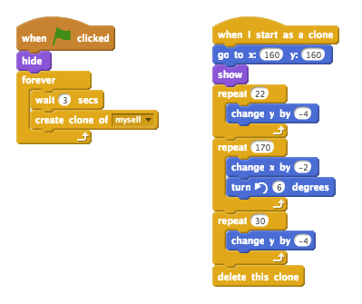

## Izbjegavanje lopti

Sada kada imaš karaktera koji se kreće, dodajmo nekoliko lopti koje će tvoj karakter izbjegavati.

+ Kreiraj novi lik (sprite) lopte. Možeš da izabereš bilo koju vrstu lopte koja ti se sviđa.
    
    

+ Izmijeni veličinu lopte kako bi tvoj karakter mogao da je preskoči. Isprobaj loptu tako što ćeš pokušati da je preskočiš.
    
    

+ Svojoj lopti dodaj ovaj kôd:
    
    
    
    Ovaj kôd svake 3 sekunde kreira novog klona lopte. Svaki novi klon kreće se po gornjoj platformi.

+ Klikni na zastavicu da ovo isprobaš.
    
    

+ Dodaj još kôda svom liku lopte, kako bi se kretao preko sve 3 platforme.
    
    

+ Na kraju, biće ti potreban kôd za situaciju kada tvog karaktera udari lopta! Dodaj ovaj kôd liku lopte:
    
    ```blocks
        when I start as a clone
        forever
            if < touching [Pico hoda v]? > then
                broadcast [udaren v]
            end
        end
    ```

+ Svom karakteru treba da dodaš i kôd koji će ga vraćati na početak kada je udaren:
    
    ```blocks
        when I receive [udaren v]
        point in direction (90 v)
        go to x: (-210) y: (-120)
    ```

+ Isprobaj svog karaktera i provjeri da li se vraća na početak kada ga udari lopta.