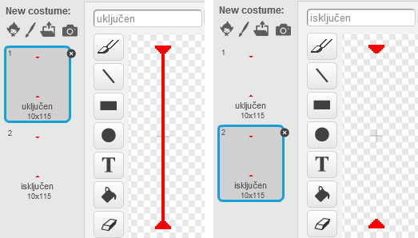

## Laseri!

Napravimo da je tvoju igru malo teže odigrati tako što ćemo dodati lasere!

+ Dodaj u svoju igru novi lik (sprite) pod nazivom 'Laser'. Lik treba da ima 2 kostima, sa nazivima 'uključen' i 'isključen'.
    
    

+ Postavi laser gdje god želiš između 2 platfome.
    
    

+ Dodaj svom laseru kôd kako bi mijenjao kostime.
    
    ```blocks
        when flag clicked
        forever
            switch costume to [uključen v]
            wait (2) secs
            switch costume to [isključen v]
            wait (2) secs
        end
    ```
    
    Ako želiš, možeš `čekati`{:class="blockcontrol"} (wait) `slučajan`{:class="blockoperators"} (random) period vremena između zamjene kostima.

+ Na kraju, dodaj svom laseru kôd da se pošalje (broadcast) poruka 'udaren' kada laser dodirne (touches) tvog karaktera. Ovaj kôd će biti veoma sličan kôdu koji si dodao/dodala liku lopte.
    
    Ne treba da dodaješ još kôda svom karakteru - on već zna šta da uradi kada je udaren!

+ Isprobaj svoju igru da provjeriš da li možeš da prođeš kroz laser. Izmijeni vrijeme u blokovima `wait`{:class="blockcontrol"} (čekaj) svog kôda ako su laseri previše laki ili previše teški.