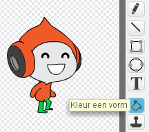

--- challenge ---

## Uitdaging: verbeterde zwaartekracht

Er is nog een andere kleine fout in het spel: de zwaartekracht trekt je personage niet naar beneden zolang *elk* deel ervan een blauw platform raakt - zelfs zijn hoofd! Je kunt dit uitproberen door het grootste deel van de ladder op te klimmen en vervolgens naar links te gaan.


Kun je deze fout (Engels: bug) repareren? Om dat te doen moet je het personage een broek geven met een andere kleur (op *alle* uiterlijken)...



... en vervang dan de code:

```blocks
  <raak ik kleur [#0000FF] ?>
```

door:

```blocks
  <kleur [#00FF00] raakt [#0000FF] ?>
```

Vergeet niet om de verbeteringen te testen om zeker te weten dat de bug is opgelost!

--- /challenge ---
