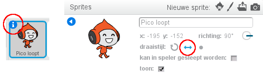

## Voortbeweging personage

Laten we beginnen met het creëren van een personage dat naar links en rechts kan bewegen, maar ook ladders kan beklimmen.

+ Open het 'Trefbal' Scratchproject online op <a href="http://jumpto.cc/dodge-go" target="_blank">jumpto.cc/dodge-go</a> of download het van <a href="http://jumpto.cc/dodge-get" target="_blank">jumpto.cc/dodge-get</a> en open het dan als je de offline-editor gebruikt.
    
    Het project bevat een achtergrond met platforms:
    
    

+ Voeg een nieuwe sprite toe, dat wordt je personage. Het is beter als je een sprite kiest met meerdere uiterlijken, zodat je kunt laten lijken dat loopt.
    
    

+ Laten we de pijltjestoetsen gebruiken om je personage te verplaatsen. Wanneer de speler op de pijl naar rechts drukt, wil je dat het personage zich naar rechts richt, een paar stappen maakt en naar het volgende uiterlijk gaat:
  
```blocks
    wanneer groene vlag wordt aangeklikt
herhaal 
  als <toets [pijltje rechts v] ingedrukt?> dan 
    richt naar (90 v) graden
    neem (3) stappen
    volgend uiterlijk
  end
end
```

+ Test je personage door op de vlag te klikken en de toets pijl naar rechts ingedrukt te houden. Gaat je speler naar rechts? Lijkt het erop dat je personage loopt?
    
    

+ Om je personage naar links te laten lopen moet je nog een `als`{:class="blockcontrol"} -blok toevoegen in je `herhaal`{:class ="blockcontrol"} -lus.

+ Test de nieuwe code om te controleren of die werkt. Staat je personage ondersteboven als je naar links loopt?
    
    
    
    Zo ja, dan kun je dit probleem oplossen door in het pictogram van de sprite op de `(i)`{:class="blocksensing"} te klikken en dan de pijl die naar links en rechts wijst te selecteren.
    
    
    
    Of, als je wilt, kun je dit blok toevoegen aan het begin van het script van je personage:
    
```blocks
maak draaistijl [links-rechts v]
```

+ Om een ​​roze ladder te beklimmen, moet het personage een beetje omhoog gaan wanneer de pijl naar omhoog wordt ingedrukt en de juiste kleur wordt aangeraakt. Voeg deze code toe binnen de `herhaal`{:class="blockcontrol"} -lus van je personage:
    
```blocks
  als <<toets [pijltje omhoog v] ingedrukt?> en <raak ik kleur [#ff00bf] ?>> dan 
  verander y met (4)
end
```

+ Test het personage - kun je de roze ladders beklimmen en aan het einde van je level komen?
    
    
