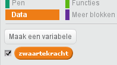

## Zwaartekracht en springen

Laten we het personage realistischer laten bewegen door zwaartekracht toe te voegen en het te laten springen.

+ Je hebt misschien gemerkt dat je personage van een platform in de lucht kan lopen. Probeer van een platform af te lopen en kijk wat er gebeurt.
    
    

+ Om dit te verhelpen, voegen we zwaartekracht toe aan je spel. Maak een nieuwe variabele met de naam `zwaartekracht`{:class="blockdata"}. Je kunt deze variabele verbergen als je dat wilt.
    
    

+ Voeg dit nieuwe codeblok toe waarin de zwaartekracht een negatief getal krijgt en gebruik dit om de y-coördinaat van het personage steeds weer te veranderen.
    
```blocks
wanneer groene vlag wordt aangeklikt
maak [zwaartekracht v] [-4]
herhaal 
  verander y met (zwaartekracht)
end
```

+ Klik op de vlag en sleep het personage naar de bovenkant van het werkgebied. Wat gebeurt er? Werkt de zwaartekracht zoals je had verwacht?
    
    

+ Zwaartekracht zou je personage niet door een platform of een ladder moeten laten gaan! Voeg een `als`{:class="blockcontrol"} -blok toe aan je code zodat de zwaartekracht alleen werkt wanneer je personage in de lucht is. De zwaartekrachtcode zou er nu als volgt uit moeten zien:
    
```blocks
wanneer groene vlag wordt aangeklikt
maak [zwaartekracht v] [-4]
herhaal 
  als <niet <<raak ik kleur [#003fff] ?> of <raak ik kleur [#ff00bf] ?>>> dan 
    verander y met (zwaartekracht)
  end
end
```

+ Test de zwaartekracht opnieuw. Stopt het personage als die op een platform of ladder staat? Kun je vanaf de rand van de platforms naar het onderliggende niveau lopen?
    
    

+ We gaan ook je personage laten springen wanneer de speler op de spatiebalk drukt. Een erg makkelijke manier om dit te doen, is door je personage een paar keer omhoog te bewegen met behulp van deze code:
    
```blocks
wanneer [spatiebalk v] wordt ingedrukt
herhaal (10) keer 
  verander y met (4)
end
```

Omdat de zwaartekracht je personage steeds met 4 pixels omlaag duwt, moet je een getal groter dan 4 kiezen in het blok `verander y met (4)`{:class="blockmotion"}. Pas dit getal aan tot je tevreden bent met de hoogte waarmee je personage springt.

+ Als je deze code test, zul je merken dat het wel werkt maar niet erg soepel gaat. Om het springen soepeler te laten lijken, moet je het personage in steeds kleinere stapjes verplaatsen, totdat het niet meer springt.

+ Maak daarvoor een andere variabele met de naam `springhoogte`{:class="blockdata"}. Je kunt deze variabele weer verbergen als je dat wilt.

+ Verwijder de springcode die je aan je personage hebt toegevoegd en vervang die door deze code:
    
```blocks
wanneer [spatiebalk v] wordt ingedrukt
maak [springhoogte v] [8]
herhaal tot <(springhoogte) = [0]> 
  verander y met (springhoogte)
  verander [springhoogte v] met (-0.5)
end
```

Deze code verplaatst je personage met 8 pixels, dan met 7,5 pixels, dan 7 pixels, enzovoorts, totdat het personage klaar is met springen. Hierdoor ziet springen er veel soepeler uit.

+ Wijzig de beginwaarde van de `springhoogte`{:class="blockdata"} -variabele en test het tot je tevreden bent met hoe hoog het personage springt.