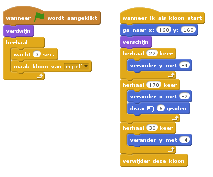

## Ballen ontwijken

Nu je het personage in beweging hebt, gaan we wat ballen toevoegen die het moet gaan ontwijken.

+ Maak een nieuwe balsprite. Je kunt elke soort bal kiezen die je leuk vindt.
    
    

+ Verklein je bal, zodat het personage eroverheen kan springen. Probeer over de bal te springen om te testen.
    
    

+ Voeg deze code toe aan je bal:
    
    
    
    Deze code maakt elke 3 seconden een nieuwe kloon van de bal. Elke nieuwe kloon rolt over het bovenste platform.

+ Klik op de vlag om dit te testen.
    
    

+ Voeg meer code toe aan je balsprite, zodat die over alle 3 de platforms kan bewegen.
    
    

+ Tot slot heb je nog code nodig voor het geval dat je personage wordt geraakt door een bal! Voeg deze code toe aan je balsprite:
    
```blocks
wanneer ik als kloon start
herhaal 
  als <raak ik [Pico loopt v] ?> dan 
    zend signaal [raak v]
  end
end
```

+ Je moet ook code aan je personage toevoegen zodat die, als die wordt geraakt, teruggaat naar het begin:
    
```blocks
wanneer ik signaal [raak v] ontvang
richt naar (90 v) graden
ga naar x: (-210) y: (-120)
```

+ Test het personage en kijk of die teruggaat naar het begin als het door een bal is geraakt.
