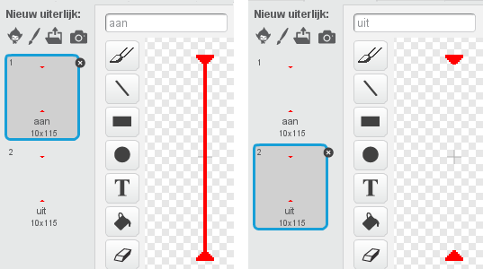

## Lasers!

We gaan het een beetje lastiger maken om het spel uit te spelen, door lasers toe te voegen!

+ Voeg een nieuwe sprite toe aan je spel, genaamd 'Laser'. Het zou 2 uiterlijken moeten hebben die 'aan' en 'uit' heten.
    
    

+ Zet je nieuwe laser overal waar je maar wilt, tussen twee platforms.
    
    

+ Voeg code toe aan je laser, zodat die kan wisselen tussen de 2 uiterlijken.
    
```blocks
wanneer groene vlag wordt aangeklikt
herhaal 
  verander uiterlijk naar [aan v]
  wacht (2) sec.
  verander uiterlijk naar [uit v]
  wacht (2) sec.
end
```

Als je wilt, kun je een `willekeurig`{:class="blockoperators"}e tijd `wacht`{:class="blockcontrol"}en tussen het wisselen van de uiterlijken.

+ Voeg tot slot code toe aan de laser, zodat het 'raak'-signaal wordt uitgezonden als de laser het personage raakt. Deze code zal erg lijken op de code die je aan je balsprite hebt toegevoegd.
    
    Je hoeft geen code meer aan het personage toe te voegen - het weet al wat het moet doen als het wordt geraakt!

+ Test je spel om te zien of je voorbij de laser kunt komen. Wijzig de `wacht`{:class="blockcontrol"} -tijden in je code als de lasers te gemakkelijk of te moeilijk zijn.