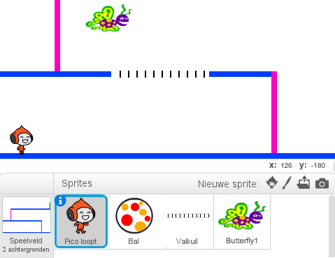

--- challenge ---

## Uitdaging: meer hindernissen

Als je denkt dat je spel nog steeds te gemakkelijk is, kun je meer hindernissen toevoegen aan je level. Je kunt alles toevoegen wat je maar wilt, maar hier zijn wat ideeën:

+ Een vliegende moordende vlinder;
+ Platforms die verschijnen en verdwijnen;
+ Vallende tennisballen die moeten worden ontweken.



Je kunt zelfs meer dan één achtergrond maken en naar het volgende level gaan wanneer je personage de groene deur bereikt:

```blocks
  als <raak ik kleur [#00ff00] ?> dan 
  verander achtergrond naar [volgende achtergrond v]
  ga naar x: (-210) y: (-120)
  wacht (1) sec.
end
```

--- /challenge ---